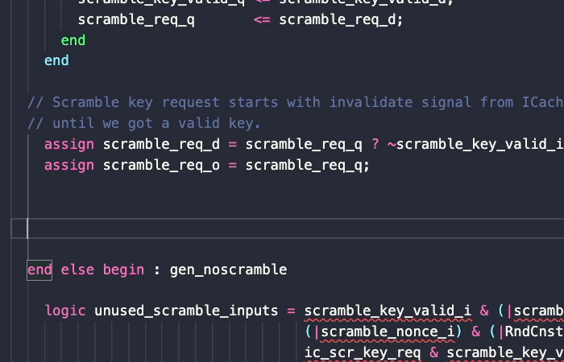
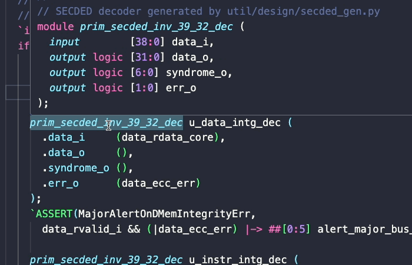

# Slang Server

`slang-server` is a [Language Server](https://microsoft.github.io/language-server-protocol/) for SystemVerilog using the [Slang](https://github.com/MikePopoloski/slang) Library. It provides useful language features for editors like Vscode and Neovim.

See [the docs](https://hudson-trading.github.io/slang-server) for instructions on [installing](https://hudson-trading.github.io/slang-server/start/installing/) and [configuring](https://hudson-trading.github.io/slang-server/start/config/).

Contributions are welcome! See [DEVELOPING.md](DEVELOPING.md)

## Features

Quick, high quality lint messages on from [Slang]() on every keystroke, with links to the [Slang warning reference]().

Informative hovers and gotos on nearly every symbol across your workspace and libraries.

Intuitive completions for module instances and macros, as well as scope members of packages, modules, structs, and more.

HDL-specific features that allow you to easily set a filelist or top level for a design, browse the elaborated hierarchy, and interact with waveform viewers.

For more detailed feature info, see [the docs](https://hudson-trading.github.io/slang-server/features/features/).
