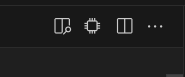
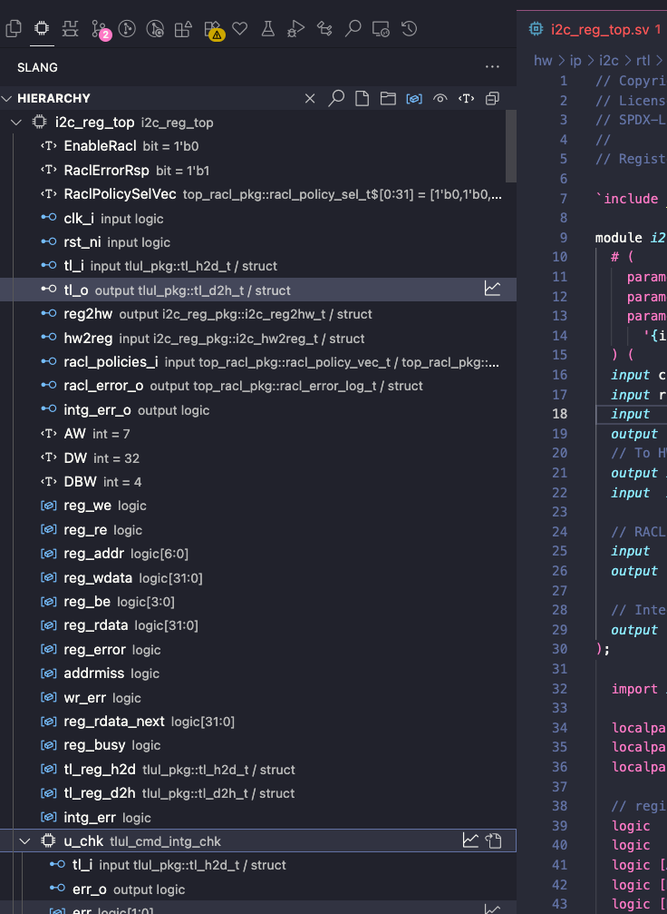
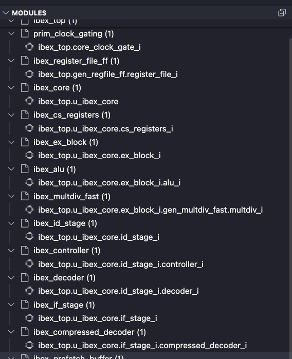
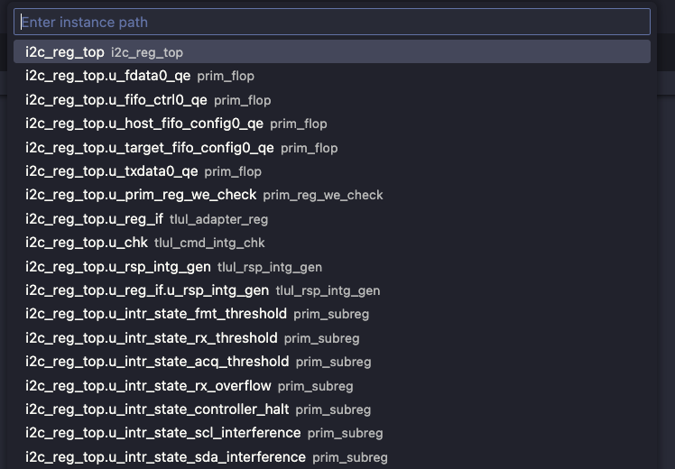
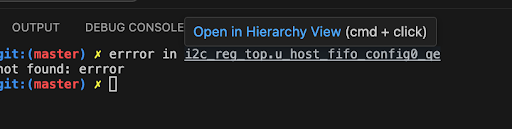

---
hide:
  # - toc
  # - navigation
  - feedback
---

# Hardware Language Features - Vscode

## Setting a Compilation

### Setting a build file

A build pattern can be configured to glob for .f files based on your build system. The default is `**/*.f`. Then you can run the "Select Build File" Command from the hierarchy view or as a general command.

### Setting a top level

The 'chip' icon at the top right of a file will scan the current file for valid top levels, and find all necessary files for a compilation.

## Hierarchy View

The Hierarchy View shows the elaborated tree, with declared types and resolved values to the right of the identifier.
Interface ports and their elaborated members are included alongside modules, generate scopes, parameters, ports, and data signals. Data signals are visible by default. Parameters can be toggled for modules, while package parameters remain visible whenever their package is shown.

Clicking a symbol opens its source location and makes its enclosing module or interface the [active instance](hdl.md#active-instances). The Hierarchy and Modules views follow the new selection. Scopes with no visible children are shown as leaves rather than expandable nodes.

**Hierarchy Buttons (left to right):**

- Clear top level
- Select Instance
- Open selected build file
- Select build file (from glob)
- Toggle data signals
- Toggle symbols defined behind macro usages.
- Toggle parameters
- Collapse all

**Tree Item Buttons**

- Open in waveform (or press `w`)
    - For scopes, this will add the children recursively
    - Some signals like structs may not open, this will be fixed in a future release
- Open Module - This will open the module rather than the instance
- Copy path (`cmd+c`, or right click > copy path)

**Vaporview Buttons**

[Vaporview](https://github.com/Lramseyer/vaporview) is a vscode waveform viewer that integrates with `slang-server`.

- Open in Editor (or press `e` with selected signal)
- At the moment, pressing `e` only works on selected signal, not selected netlist item

## Modules View

The Modules view groups elaborated instances by their module or interface definition.

Click an instance path to make it active and open its definition. Use the **Go to Instantiation** button on an instance path to open the instantiation site instead; the view also reveals the corresponding parent instance.

The selected instance determines the resolved parameter values, dependent types and widths, interface connections, and other elaboration-specific information shown while editing that definition.

## Active Instance CodeLens

With a compilation active, a CodeLens above each instantiated module or interface declaration displays its active hierarchical path and total instance count. Click it to choose another instance when more than one exists. A neighboring **Go to Instantiation** CodeLens opens the selected instance's instantiation site.

Generate loops also receive a CodeLens when the active module instance contains multiple elaborated iterations. Selecting an iteration updates the context used by source features.

Instance selections stay synchronized across CodeLens actions, Go to Definition, the Hierarchy view, and the Modules view. Hovers and the `inlayHints.activeParameterValues` hints update to show values from the selected instance.

## Inactive Preprocessor Regions

Code inside untaken preprocessor branches (e.g. `` `ifdef`` / `` `ifndef``) is grayed out to visually distinguish it from active code.

The appearance is controlled by `slang.inactiveRegions.style`:

- `"opacity"` (default) — Renders inactive regions at reduced opacity. Controlled by `slang.inactiveRegions.opacity` (default 0.55).
- `"background"` — Highlights inactive regions with a background color. Controlled by `slang.inactiveRegions.backgroundColor` (default `#1212124C`).
- `"none"` — Disables inactive region highlighting.

## Setting an Instance

### `slang: Select Instance` Command

  

  This command pulls up a fuzzy finder where you can enter the hierarchical path of a scope/instance.

  It's also available via the magnifying glass icon in the Hierachy view, or by pressing `cmd+f` while the sidebar is in focus.

  

  

  

  

### Terminal Links

  

  Hierarchical paths are automatically recognized for vscode-integrated terminals. Clicking on these will set the compilation based on the top name as well as the instance. Even if the exact instance can't be found, it will eagerly open the instance and show an error on the invalid id.

  

  

  

  

