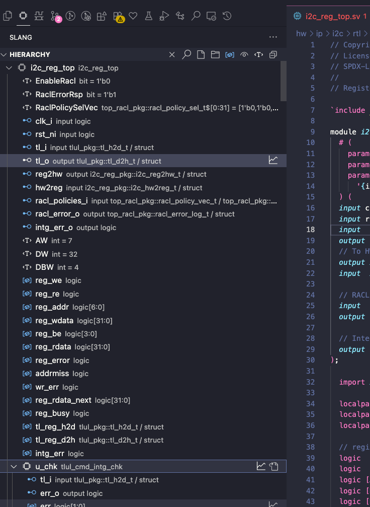

---
hide:
  # - toc
  # - navigation
  - feedback
---

# Hardware Language Features

When a compilation is set, a full hierarchy will be elaborated in conjunction with the shallow compilations per file, which are still used to get quick language features on all tokens. The compilation is refreshed on save.

See the [Vscode Docs](./vscode.md)

See the [Neovim Docs](./neovim.md)

