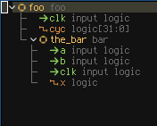
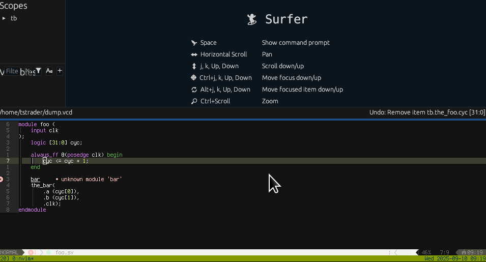

---
hide:
  # - toc
  # - navigation
  - feedback
---

# Hardware Language Features - Neovim

All features listed here require the Neovim plugin.  See the [installation guide](../start/installing.md) for how to get started.
Once installed the `SlangServer` command will provide a number of subcommands outlined below.

## Setting a Compilation

### Setting a build file

```
:SlangServer setBuildFile BUILDFILE
```

This uses the file located at `BUILDFILE`` to compile a full hierarchy and is required for some of the commands below.

### Setting a top level

```
:SlangServer setTopLevel [TOPFILE]
```

This uses a file to run a compilation using the top-most module in the provided file.  If `TOPFILE` is not provided the file from the current buffer will be used.

## HierarchyView

```
:SlangServer hierarchy [SCOPE]
```

This will open the hierarchy view and, if `SCOPE` is provided, expand the view to that scope.



## Cone Tracing (experimental)

```
:lua vim.lsp.buf.incoming_calls()
```
```
:lua vim.lsp.buf.outgoing_calls()
```

This allows for drivers/loads tracing over the [call hierarchy lsp route](https://neovim.io/doc/user/lsp.html#vim.lsp.buf.incoming_calls()), since it's an analogous concept.  Tracing incoming calls yields drivers of a given signal and outgoing calls yields loads or things the signal drives.
Calling one of these functions will trace the signal currently under the cursor.
If there is more than one instance of the signal then first a list of instances will be presented.
After an instance is selected (or if there is only one instance) a list of drivers or loads will be presented.

## Waveform Integration (experimental)



`slang-server` can interact with waveform viewers via the [WCP (waveform control protocol)](https://gitlab.com/waveform-control-protocol/wcp).
The only known implementation of WCP is currently in [Surfer](https://surfer-project.org/).

### Editor Features

#### Open Waveform File

```
:SlangServer openWaveform WAVEFILE
```

This opens the waveform file (e.g. VCD or FST) indicated by `WAVEFILE`.
If there is no currently active WCP session a new waveform viewer will be launched using the command provided in the `wcpCommand` config field.
By default this is Surfer.
If a WCP session already exists, the new waveform file will be loaded.
Additionally, if a `buildPattern` config field is provided, the build file which corresponds to the current wave file will be used to produce a compilation.
E.g. given a wave file of `/some/dir/foo.fst` and a `buildPattern` of `/some/other/dir/{}.f` and compilation will be made using `/some/other/dir/foo.f`.


#### Add Item

```
:SlangServer addToWaves [RECURSIVE]
```

Adds the signal, module, interface or other scope currently under the cursor to the waveform viewer.
If `RECURSIVE` is provided and is `true` and the item is a scope it will be added recursively.
If more than one instance of the item exists, a list of instances will be provided to choose from.

### Wave Viewer Features
- Goto Definition
- Add Drivers
- Add Loads
