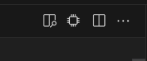

---
hide:
  # - toc
  # - navigation
  - feedback
---

# Hardware Language Features - Vscode

## Setting a Compilation

### Setting a build file

A build pattern can be set to glob for .f files, e.g. `**/*.f`. Then you can run the "Select Build File" Command from the hierarchy view or as a general command. The general LSP command is `setBuildFile(path: str)`.

### Setting a top level

The 'chip' icon at the top right of a file will scan the current file for valid top levels, and find all necessary files for a compilation.

## Hierarchy View

The Hierarchy View shows the elaborated tree, with declared types and resolved values to the right of the identifier.

**Hierarchy Buttons (left to right):**
- Clear Top Level
- Set Build File
- Toggle data- wires, registers, etc.
- Toggle objects defined behind macro usages.
- Toggle paramters- params, localparams, etc.
- Collapse all

Buttons exist on each object to copy its hierarchical path. An extra button exists on modules to go to the module definition, rather than the instantiation of that module.

Clicking a symbol in the hierarchy view or modules view will open the instance in the file, as well as in the other view.

## Modules View

The modules view shows the instances indexed by module, sorted by the number of instances with higher level objects closer to the top.

## Setting a scope

### `Slang: Select Scope` Command

This command pulls up a fuzzy finder where you can enter the hierarchical path.

### Terminal Links

Hierarchical paths are automatically recognized for vscode-integrated terminals, and will set the compilation and the instance. Even if the exact instance can't be found, it will eagerly open the instance until the names are invalid.

