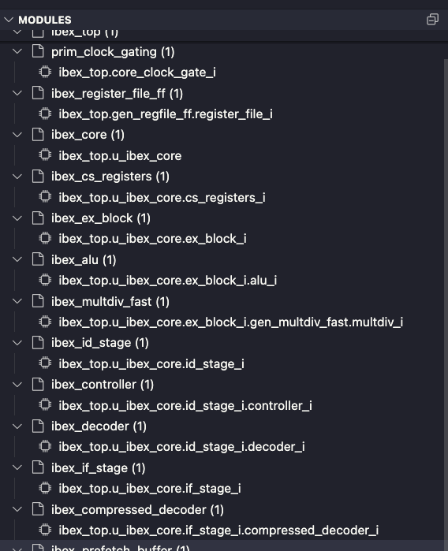

---
hide:
  # - toc
  # - navigation
  - feedback
---

# Hardware Language Features - Vscode

## Setting a Compilation

### Setting a build file

A build pattern can be configured to glob for .f files based on your build system. The default is `**/*.f`. Then you can run the "Select Build File" Command from the hierarchy view or as a general command.

### Setting a top level

The 'chip' icon at the top right of a file will scan the current file for valid top levels, and find all necessary files for a compilation.

## Hierarchy View

The Hierarchy View shows the elaborated tree, with declared types and resolved values to the right of the identifier.
Clicking a symbol in the hierarchy view or modules view will open the instance in the file, as well as in the other view.

**Hierarchy Buttons (left to right):**

- Clear top level
- Select Instance
- Open selected build file
- Select build file (from glob)
- Toggle data signals
- Toggle symbols defined behind macro usages.
- Toggle parameters
- Collapse all

**Tree Item Buttons**

- Open in waveform (or press `w`)
    - For scopes, this will add the children recursively
    - Some signals like structs may not open, this will be fixed in a future release
- Open Module - This will open the module rather than the instance
- Copy path (`cmd+c`, or right click > copy path)

**Vaporview Buttons**

- Open in Editor (or press `e` with selected signal)
- At the moment, pressing `e` only works on selected signal, not selected netlist item

## Modules View

The modules view shows the instances indexed by module, sorted by the number of instances with higher level objects closer to the top.

While a compilation is active, the modules view will open when switching text documents, allowing the user to select which instance of that module they'd like to focus on. In the future, inlay hints will show values for parameters and signals in the source code.

## Setting an Instance

### `Slang: Select Instance` Command

  

  This command pulls up a fuzzy finder where you can enter the hierarchical path of a scope/instance.

  It's also available via the magnifying glass icon in the Hierachy view, or by pressing `cmd+f` while the sidebar is in focus.

  

  

  

  

### Terminal Links

  

  Hierarchical paths are automatically recognized for vscode-integrated terminals. Clicking on these will set the compilation based on the top name as well as the instance. Even if the exact instance can't be found, it will eagerly open the instance and show an error on the invalid id.

  

  

  

  

